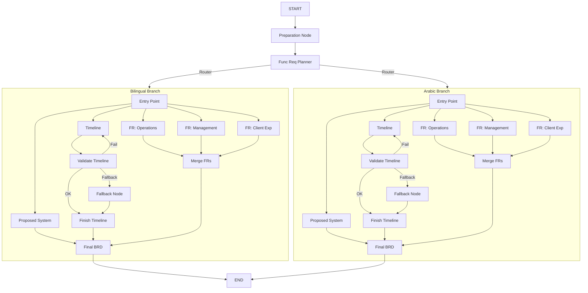

# BRD Agent Antigravity - Technical Documentation

## Overview
BRD Agent Antigravity is a modular AI system designed for generating and intelligently editing Business Requirements Documents (BRDs). It utilizes a graph-based workflow for initial generation and a specialized service layer for section-specific modifications. The system is optimized for Arabic and Bilingual (English/Arabic) outputs, ensuring consistent business logic and high-quality phrasing.

---

## Overall System Architecture
The system is divided into three main layers:

1.  **Workflow Layer (LangGraph)**: Orchestrates the multi-stage generation process.
2.  **Service Layer**: Encapsulates logic for editing specific BRD sections (Proposed System, Functional Requirements, Timeline).
3.  **Prompt & Schema Layer**: Defines the "brain" and the "structure" of the AI outputs using highly specific templates and Pydantic models.

---

## 1. Project Structure & File Map

### Core Directory: `src/`

#### 📂 `graph/` - Generation Logic
- `workflow.py`: Defines the LangGraph `StateGraph`, connecting nodes and defining the parallel/sequential flow.
- `state.py`: Defines `GraphState`, the central data structure passed between nodes.
- `nodes/`: Contains the implementation of each graph node.
    - `base_nodes.py`: Shared logic for section generation (Proposed System, Timeline).
    - `common_nodes.py`: Universal nodes like `preparation`, `router`, and `planner`.
    - `arabic_nodes.py` & `bilingual_nodes.py`: Specific implementations for different language outputs.
- `validators/`: Logic for validating section content (e.g., timeline structure).

#### 📂 `services/` - Editing & Business Logic
- `PlatformService.py`: Handles edits for the **Proposed System**. Implements Mode A/B logic and context updates.
- `TimelineService.py`: Manages the **Implementation Timeline**. Includes complex logic for preserving and recalculating numeric values (prices/durations).
- `FunctionalReqService.py`: Manages **Functional Requirements** edits, allowing for structural feature/module changes.
- `NormalizeService.py`: Pre-processes inputs to ensure consistent data formats.
- `BRDService.py`: High-level orchestrator that interacts with the overall BRD structure.

#### 📂 `prompts/` - AI Instruction Templates
- `preparation_prompt.py`: Instructions for the initial project normalization.
- `edit_platforms_prompt.py`, `edit_timeline_prompts.py`, `edit_func_req_prompts.py`: Classifier and revision templates for the edit services.
- `proposed_system_prompt.py`, `timeline_prompt.py`: Generation templates for initial BRD creation.

#### 📂 `schemas/` - Data Models
- `preparation.py`: Defines `PreparationOutput` (the "Enhanced Context").
- `sections_output.py`: Pydantic models for structured section outputs.

#### 📂 `llm/` - LLM Interaction
- `invoke.py`: The bridge to the LLM (OpenAI/Google), enforcing structured output via Pydantic.

---

## 2. Generation Flow Diagram

The system uses a branched graph to handle language requirements. Below is the logical flow of a document generation:

---

## 3. Detailed Node Mechanics

### **Preparation Node**
- **Goal**: Convert vague user input into a structured "Enhanced Context".
- **Logic**: It detects platforms, roles, and project scope. The output (`PreparationOutput`) is the single source of truth for all subsequent nodes.

### **Functional Req Planner**
- **Goal**: Break down the project into logical functional modules.
- **Logic**: It identifies three core areas: Operations, Internal Management, and Client Experience, ensuring comprehensive coverage.

### **Section Generators (Proposed System, Timeline, FRs)**
- **Goal**: Generate section-specific content based on the context.
- **Proposed System**: Uses a strict **One-to-One Rule** (one entry per platform-role pair).
- **Timeline**: Creates sequential phases. If `is_agile` is true, it ensures every phase includes Analysis, Design, Development, and Testing.

### **Timeline Validation & Fallback**
- **Goal**: Ensure the timeline is structurally sound.
- **Logic**: If the LLM produces a timeline with the wrong number of stages or invalid sequencing, the `validate_timeline` node catches it. The system allows for up to 3 retries before using a `fallback_node` to ensure the process never hangs.

---

## 4. Editing System (Mode A / Mode B)

The editing engine uses an intelligent **Classifier** to handle modifications.

### **Mode A (Content Revision)**
- **Scope**: Tone, wording, clarity, and titles.
- **Mechanics**: The service uses a revision prompt that takes the `original_content` and `edit_content`. It applies changes locally while preserving the rest of the text.

### **Mode B (Structural Update)**
- **Scope**: Adding/removing platforms, roles, or changing the project's core truth.
- **Mechanics**: 
    1. **Context Update**: The "Enhanced Context" is updated first.
    2. **Regeneration**: Affected sections are regenerated from scratch using the new context.
- **Mixed Edit Rule**: If a request contains both structural changes and wording improvements, it is automatically elevated to **Mode B** to ensure the document remains logically consistent.

---

## 5. Specialized Logic: Timeline Numeric Protection
The `TimelineService` implements a "Preservation & Enrichment" pattern:
1. **Preservation**: For Mode A edits, the system manually forces `price`, `duration_count`, and `phase_number` from the original data into the new version to prevent "hallucinated" changes.
2. **Recalculation**: For Mode B edits (e.g., changing the number of stages), the system recalculates the price per stage based on the original total project cost, ensuring financial consistency.
